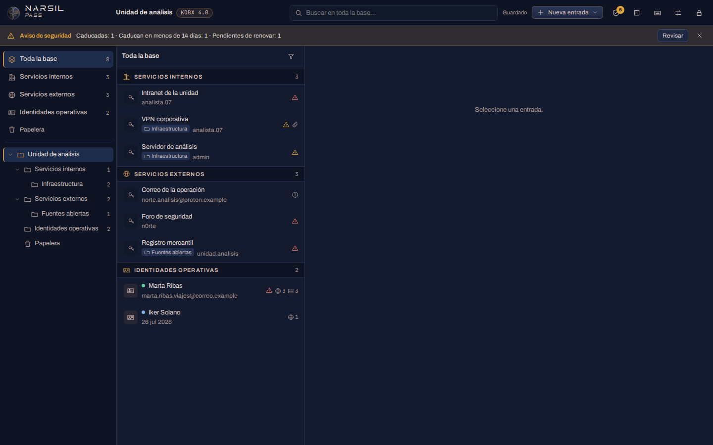
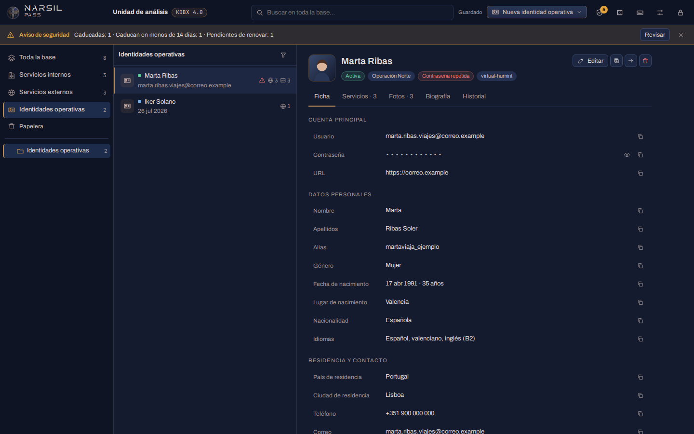
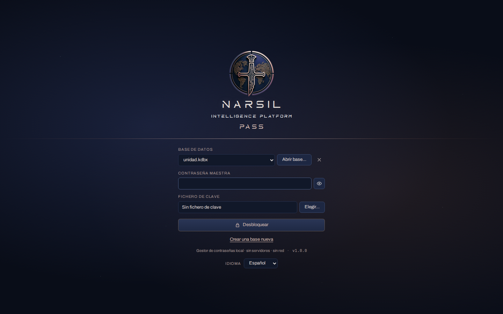
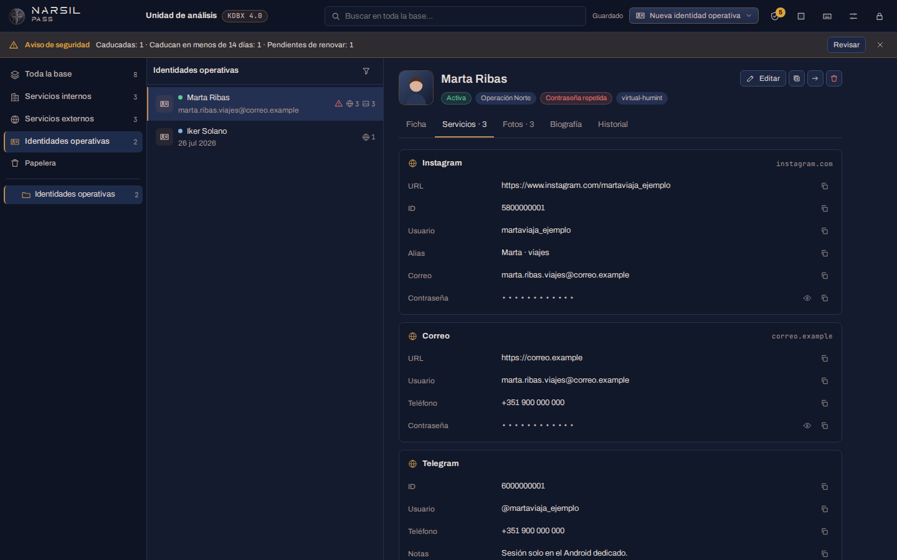
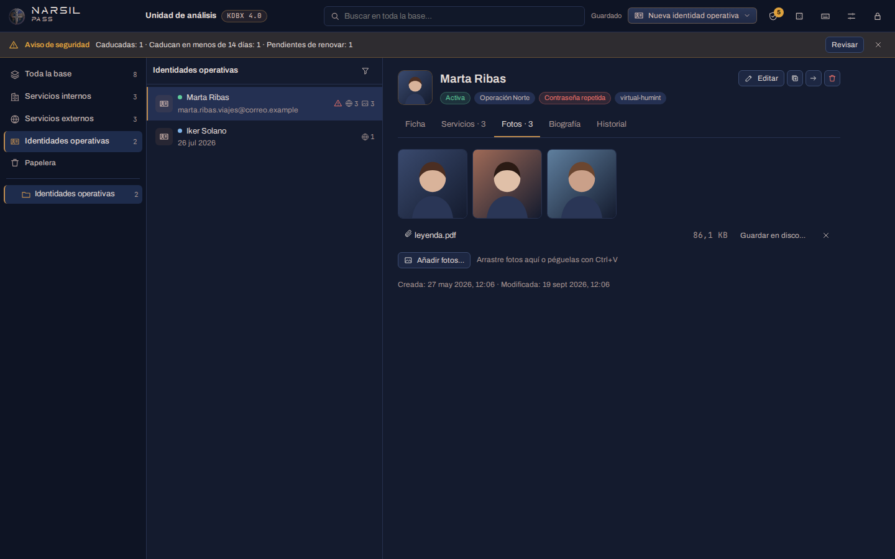
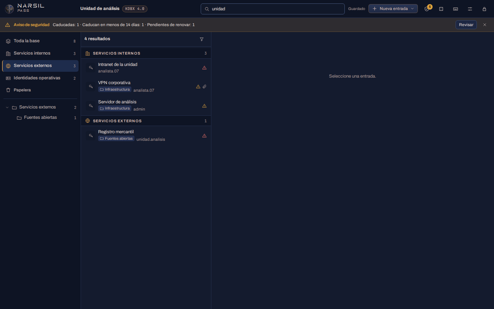
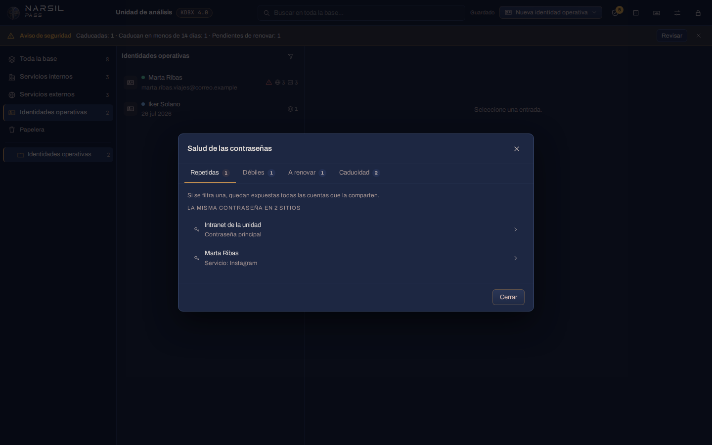

<p align="center">
  
</p>

<h1 align="center">NARSIL Pass</h1>

<p align="center">
  Gestor de contraseñas local para el investigador: servicios internos, servicios externos e identidades operativas.<br>
  Parte de <strong>NARSIL Intelligence Platform</strong>.
</p>

<p align="center">
  
  
  
  
  
</p>

> **Un desarrollo propio de NARSIL Intelligence.** NARSIL Pass es el gestor de contraseñas de
> *NARSIL Intelligence Platform*, la plataforma de investigación en fuentes abiertas que
> desarrollamos íntegramente en NARSIL Intelligence: el **Módulo de navegación** con sus
> identidades aisladas, **S.A.R.A.**, el arnés de investigación supervisada con expedientes,
> cartografía y monitorización, **NARSIL Brain**, la inteligencia que trabaja dentro, y este
> gestor, donde el investigador guarda las credenciales y las identidades con las que trabaja.
> NARSIL Pass se ofrece completo y sin coste a cualquier investigador u organización; el resto de
> la plataforma se presenta en [narsilintelligence.com/narsil-ip](https://narsilintelligence.com/narsil-ip).

<p align="center">
  <a href="https://github.com/narsilintelligence/narsil-pass/releases/latest"><strong>⬇ Descargar la última versión</strong></a>
  &nbsp;·&nbsp; <a href="#instalación">Instalación</a>
  &nbsp;·&nbsp; <a href="#cómo-se-usa">Cómo se usa</a>
  &nbsp;·&nbsp; <a href="#base-de-ejemplo">Base de ejemplo</a>
  &nbsp;·&nbsp; <a href="docs/SEGURIDAD.md">Seguridad</a>
  &nbsp;·&nbsp; <a href="https://narsilintelligence.com">narsilintelligence.com</a>
</p>

<p align="center">
  
</p>

---

## Qué es

Un investigador maneja tres tipos de secretos que no deben mezclarse:

- **Servicios internos.** Las cuentas de su propia organización: intranet, VPN, servidores,
  aplicaciones de la unidad.
- **Servicios externos.** Las cuentas con las que trabaja fuera: registros oficiales,
  plataformas de monitorización, correo operativo, fuentes abiertas de pago.
- **Identidades operativas.** Los avatares de *Virtual HUMINT*: cada uno con su leyenda, su ficha,
  los servicios en los que está dado de alta con sus credenciales, su biografía y su juego de
  fotos. Sostener un avatar en el tiempo exige tener todo eso junto y a mano.

NARSIL Pass guarda los tres en **un único fichero cifrado que controla el usuario**, separados en
secciones, sin servidores, sin sincronización y sin conexión a internet. Y lo hace en el formato de
**KeePass y KeePassXC** (`.kdbx`): una base existente se abre tal cual, sin exportar ni importar
nada, y lo que se guarda en NARSIL Pass se sigue abriendo en KeePassXC.

### Lo que hace

- **Compatible con KeePass.** Lee y escribe **KDBX 4** y **KDBX 3.1**, y guarda cada base **en su
  mismo formato y versión**: si trae una base 3.1, sigue siendo 3.1 (se puede convertir a KDBX 4
  desde Ajustes cuando se quiera). Todo lo que NARSIL Pass no usa (AutoType, datos de complementos,
  iconos) se conserva intacto al guardar.
- **Tres secciones y la base completa.** *Toda la base* muestra todas las entradas agrupadas por
  sección; *Servicios internos*, *Servicios externos* e *Identidades operativas* muestran cada una
  lo suyo, con sus subcarpetas. Las secciones son grupos normales de KeePass: una base antigua se
  organiza con un botón, o se elige qué grupo existente hace de cada sección.
- **Identidades operativas completas.** Una ficha del avatar en siete bloques (datos personales,
  residencia y contacto, formación y trabajo, rasgos físicos, vida personal, huella digital y
  cobertura), **todo opcional**; los **servicios** en los que está registrada, cada uno con su ID,
  usuario, alias, correo, teléfono, URL y **contraseña propia**; una **biografía** de texto libre;
  y sus **fotos**, con miniaturas y visor a pantalla completa.
- **Búsqueda en toda la base.** Por palabras, en títulos, usuarios, URL, notas, etiquetas, fichas y
  servicios (nunca en contraseñas), y siempre sobre la base entera: los resultados aparecen
  **agrupados por sección**, con la carpeta de cada uno.
- **Filtros** por servicio, por usuario, por estado de la identidad (activa, en reposo,
  comprometida, retirada) y por avisos de seguridad.
- **Salud de las contraseñas.** Detecta las **repetidas** entre cuentas distintas, las **débiles**,
  las **caducadas** o que caducan en menos de 14 días y las **pendientes de renovar** (cada 180
  días por defecto, ajustable por base). Avisa al desbloquear y cada media hora.
- **Copiar y pegar sin fricción.** Botón de copia en cada valor, doble clic, menú con clic
  derecho, atajos de teclado y arrastrar valores a otras aplicaciones. Las contraseñas copiadas se
  **borran del portapapeles** a los pocos segundos y en Windows **no entran en el historial**
  (Win+V). Los ficheros y las fotos se añaden con el botón, arrastrándolos o pegándolos.
- **Lo que se espera de un gestor serio.** Generador de contraseñas y de frases de paso, códigos
  **TOTP**, campos propios protegidos, etiquetas, caducidad, adjuntos, **historial** de versiones
  con restauración, papelera, bloqueo manual y por inactividad, autoguardado con copia `.bak`,
  detección de cambios hechos por otro programa y seis idiomas.
- **Sin red.** La aplicación no abre ningún puerto ni se conecta a ningún sitio: ni para
  actualizarse, ni para comprobar contraseñas filtradas, ni para enviar estadísticas.

<p align="center">
  
</p>

## Instalación

Un solo fichero, sin instalador. Descargue el de su equipo desde la
[**página de versiones**](https://github.com/narsilintelligence/narsil-pass/releases/latest). Junto a los
ejecutables está `SHA256SUMS`, con la suma de cada uno, por si quiere comprobar la descarga:

| Su equipo | Fichero |
|---|---|
| Windows 10/11 de 64 bits | `narsil-pass-windows-x86_64.exe` |
| Linux de 64 bits (Ubuntu, Debian, Fedora…) | `narsil-pass-linux-x86_64` |
| Linux en ARM64 | `narsil-pass-linux-aarch64` |

**Windows.** Copie el `.exe` a una carpeta suya (por ejemplo `Documentos\NARSIL`) y haga doble clic.
Windows puede avisar de que el programa no está firmado: *Más información → Ejecutar de todas formas*.
La ventana usa WebView2, que ya viene con Windows 10 y 11.

**Linux.** Dé permiso de ejecución y arranque:

```bash
chmod +x narsil-pass-linux-x86_64
./narsil-pass-linux-x86_64
```

La ventana usa WebKitGTK; si no está, en Debian/Ubuntu: `sudo apt install python3-gi gir1.2-gtk-3.0 gir1.2-webkit2-4.1`.

Se puede pasar una base al arrancar, y quedará seleccionada: `narsil-pass-linux-x86_64 ~/Documentos/unidad.kdbx`.

### Primer arranque

<p align="center">
  
</p>

- **Si ya usa KeePass o KeePassXC:** trabaje primero con **una copia** de su base. Pulse **Abrir
  base…**, elíjala, escriba su contraseña maestra (y su fichero de clave, si lo usa) y pulse Intro.
  Verá sus grupos y entradas tal cual. Para separar lo interno, lo externo y las identidades,
  pulse **Organizar en secciones** en la columna izquierda.
- **Si empieza de cero:** **Crear una base nueva** → nombre, ubicación y contraseña maestra (y, si
  quiere, un fichero de clave generado por la app). La base se crea en KDBX 4 con ChaCha20 y
  Argon2id, ya organizada en las tres secciones.
- **Para verlo antes con datos:** abra la [base de ejemplo](#base-de-ejemplo).

## Cómo se usa

### Secciones y listado

La columna izquierda tiene **Toda la base** (primera y vista de inicio), **Servicios internos**,
**Servicios externos**, **Identidades operativas** y la **Papelera**, y debajo el árbol de carpetas
de la vista elegida. *Toda la base* y cada sección muestran todo su contenido, subcarpetas incluidas
(en *Toda la base*, agrupado por sección), con la carpeta de cada entrada bajo su título; una
carpeta concreta del árbol muestra solo sus entradas. Una entrada nueva creada desde *Toda la base*
se guarda en *Servicios internos*, para que nada quede fuera de las secciones.

Un grupo existente puede hacer de sección: en *Toda la base*, pase el ratón por el grupo y pulse el
icono de capas. Un grupo borrado va a la papelera; desde allí se recupera moviendo sus entradas.

### Entradas

**Nueva entrada** (o `Ctrl+N`) crea una credencial en la carpeta elegida: título, usuario, URL,
contraseña (con medidor de calidad y generador), notas, **campos propios** (cada uno se puede
proteger, es decir, cifrar en memoria y ocultar en pantalla), **código TOTP** (secreto base32 u
`otpauth://`), etiquetas y fecha de caducidad. En la vista de la entrada se añaden adjuntos, se
consulta el **historial** (cada modificación guarda la versión anterior, como en KeePassXC) y se
restaura cualquier versión.

### Identidades operativas

En la sección de identidades el botón principal es **Nueva identidad operativa**. El editor tiene
cuatro pestañas y **ningún campo obligatorio**:

- **Ficha:** los siete bloques del avatar. Con la fecha de nacimiento, la ficha muestra la edad
  calculada; el estado (activa, en reposo, comprometida, retirada) aparece como distintivo de
  color en la lista y en la ficha.
- **Servicios:** uno por cada plataforma en la que está registrada, con su contraseña propia (con
  generador). Se añaden y se quitan libremente.
- **Biografía:** texto libre para la historia de vida, rutinas, forma de escribir o relaciones.
- **Cuenta y opciones:** la cuenta raíz de la identidad (normalmente su correo), notas, campos
  propios, etiquetas y caducidad.

La vista de la identidad tiene las pestañas Ficha, Servicios, Fotos, Biografía e Historial. Cualquier
valor se copia con su botón o con doble clic; las contraseñas de cada servicio se revelan y se
copian una a una.

<p align="center">
  
  
</p>

**Fotos.** En la pestaña Fotos: **Añadir fotos…**, arrastrarlas desde el explorador de archivos o
pegarlas con `Ctrl+V` (por ejemplo, una captura de pantalla). Un clic abre el visor a pantalla
completa; las flechas pasan de una a otra y desde allí se guardan en disco o se quitan. Las fotos
viajan dentro de la base, cifradas, como adjuntos de la identidad.

### Buscar y filtrar

La búsqueda (`Ctrl+F`) recorre **siempre toda la base**, esté donde esté, y muestra los resultados en
bloques por sección; un clic en la cabecera de un bloque lleva a esa sección. `↓` desde el buscador
salta al primer resultado. El icono del embudo abre los **filtros** (servicio, usuario, avisos y,
en identidades, estado), que se aplican a la vista actual o, si hay texto, a la búsqueda.

<p align="center">
  
</p>

### Salud y avisos

El icono del escudo muestra cuántos avisos hay y abre el panel **Salud de las contraseñas**:
*Repetidas* (la misma contraseña en cuentas distintas; la misma cuenta anotada dos veces no cuenta),
*Débiles*, *A renovar* y *Caducidad*. Cada aviso lleva a su entrada con un clic. El plazo de
renovación (90, 180 o 365 días, o nunca) se elige en el propio panel o en *Ajustes → Base de datos*
y se guarda en la base. Al desbloquear, y cada media hora, una franja recuerda lo caducado y lo
pendiente de renovar.

<p align="center">
  
</p>

### Copiar, pegar y teclado

| Atajo | Acción |
|---|---|
| `Ctrl+F` | Buscar en toda la base |
| `Ctrl+N` | Nueva entrada (en identidades, nueva identidad) |
| `Ctrl+B` · `Ctrl+C` · `Ctrl+U` · `Ctrl+T` | Copiar usuario · contraseña · URL · código TOTP de la entrada seleccionada |
| `↑` `↓` | Moverse por la lista |
| `Intro` · `Ctrl+E` | Editar la entrada |
| `Ctrl+Intro` · `Ctrl+S` (en el editor) | Guardar la edición |
| `Esc` | Salir del editor (si hay cambios, pide confirmación) o cerrar un diálogo |
| `Supr` | Enviar a la papelera |
| `Ctrl+D` | Duplicar |
| `Ctrl+1` … `Ctrl+4` | Toda la base · Servicios internos · Servicios externos · Identidades |
| `Ctrl+S` · `Ctrl+L` | Guardar la base · Bloquear |
| `F1` | Ayuda de atajos |

Con el ratón: **doble clic** en una fila copia su contraseña, y en un valor copia ese valor; **clic
derecho** en una fila abre el menú de copia; un valor visible se puede **arrastrar** a otra
aplicación. El tiempo que la contraseña copiada permanece en el portapapeles (12 s por defecto) se
ajusta en *Ajustes*.

### Guardado, bloqueo y ajustes

- **Autoguardado** tras cada cambio (desactivable) y **copia `.bak`** de la versión anterior antes
  de sobrescribir. Cada guardado se escribe aparte, se vuelve a abrir y a comprobar, y solo entonces
  sustituye al fichero original.
- Si otro programa (KeePassXC, una sincronización) ha cambiado la base mientras estaba abierta,
  NARSIL Pass no la pisa: ofrece **Guardar como…** o sobrescribir a sabiendas.
- **Bloqueo** manual (`Ctrl+L`) y por inactividad (5 minutos por defecto): descarta la base
  descifrada y vacía el portapapeles.
- **Ajustes → Aplicación:** idioma (español, inglés, francés, alemán, italiano y portugués),
  bloqueo, portapapeles, autoguardado, copia previa y bases recientes.
- **Ajustes → Base de datos:** nombre, cifrado (ChaCha20 o AES-256), tiempo de desbloqueo (la
  resistencia frente a ataques de fuerza bruta), cambio de clave maestra, plazo de renovación y,
  en una base 3.1, la conversión a KDBX 4.

## Base de ejemplo

La carpeta [`ejemplos/`](ejemplos) trae una base **sintética y completa** para ver cómo queda una base
bien alimentada, en los dos formatos:

| Fichero | Formato |
|---|---|
| `ejemplos/NARSIL-ejemplo-KDBX4.kdbx` | KDBX 4 · ChaCha20 · Argon2id |
| `ejemplos/NARSIL-ejemplo-KDBX31.kdbx` | KDBX 3.1 · AES-256 · AES-KDF (creada por KeePassXC, rellenada por NARSIL Pass) |

**Contraseña maestra: `NarsilEjemplo-2026`.** Contiene las tres secciones con subcarpetas, quince
entradas con todos los tipos de campo (estándar, propios y protegidos, TOTP, etiquetas, caducidades,
adjuntos, historial de varias versiones), una entrada en la papelera y cuatro identidades
operativas, una por estado, con ficha, servicios, biografía y fotos. Está preparada para que *Salud*
muestre un aviso de cada tipo. Todos los datos son inventados. El inventario completo está en
[`ejemplos/LEEME.md`](ejemplos/LEEME.md) y la base se regenera con `scripts/base_ejemplo.py`.

## Compatibilidad con KeePass y KeePassXC

Lo que NARSIL Pass añade se guarda como datos normales de KeePass, de modo que KeePassXC lo abre,
lo conserva y lo muestra:

| En NARSIL Pass | En el fichero `.kdbx` |
|---|---|
| Secciones | Grupos normales; qué grupo es cada sección, en los datos personalizados de la base (`NARSIL.Secciones`) |
| Identidad operativa | Una entrada con el campo `NARSIL.Tipo = identidad` |
| Ficha del avatar | Campos `Ficha.nombre`, `Ficha.profesion`, `Ficha.biografia`… (solo los rellenos) |
| Servicios | Campos `Servicio.1.nombre`, `Servicio.1.usuario`, `Servicio.1.contrasena` (protegido)… |
| Fotos y adjuntos | Adjuntos de la entrada |
| Plazo de renovación | Datos personalizados de la base (`NARSIL.RenovarDias`) |

**Formatos:** KDBX 4.0, 4.1 y 3.1; cifrado AES-256 y ChaCha20; derivación Argon2d, Argon2id y
AES-KDF; ficheros de clave XML (v1 y v2), binarios de 32 bytes, hexadecimales y cualquier otro
fichero. **No admite** Twofish ni bases anteriores a KeePass 2.20 (lo dice al abrir y no toca el
fichero), ni bases protegidas con una llave física de desafío-respuesta (YubiKey), que no se pueden
desbloquear.

## Dónde están sus datos

- **La base** es el fichero `.kdbx` que usted elige, donde usted lo deja. NARSIL Pass no hace copias
  en otro sitio (salvo la `.bak` junto a la base, si está activada).
- **Preferencias y registro** (idioma, tiempos, bases recientes; nunca contraseñas ni contenido de
  la base): `%APPDATA%\NARSIL Pass` en Windows y `~/.config/narsil-pass` en Linux. El registro
  técnico está en su subcarpeta `registro\`.

## NARSIL Intelligence Platform

| Sistema | Qué es |
|---|---|
| **NARSIL Pass** | Este programa: credenciales e identidades operativas, en el equipo de cada investigador. Gratuito. |
| **NARSIL Navegación** | El Módulo de navegación: un navegador aislado por identidad, en el equipo de cada operador. Gratuito. |
| **NARSIL S.A.R.A.** | *Supervised Autonomous Research Architecture*: expedientes, cartografía, monitorización y agentes, en el servidor de la organización. |
| **NARSIL Brain** | La inteligencia que trabaja dentro de S.A.R.A. |

NARSIL Pass funciona solo y no necesita el resto de la plataforma.

## Privacidad y seguridad

- **Sin red:** la ventana carga la interfaz desde el propio ejecutable, no abre puertos y su
  política de contenido prohíbe cualquier conexión.
- **Formato abierto y auditable:** la criptografía es la de KeePass, implementada sobre bibliotecas
  auditadas (`cryptography`, `argon2-cffi`, `pycryptodomex`); NARSIL Pass no inventa cifrado.
- **Cada guardado se verifica** antes de sustituir la base; en Linux, además, los ficheros se crean
  legibles solo por su usuario.
- **Portapapeles con fecha de caducidad** y fuera del historial de Windows.
- **Límites que conviene conocer:** mientras la base está abierta, su contenido está descifrado en
  la memoria del programa (como en cualquier gestor); un equipo comprometido no se protege con un
  gestor de contraseñas. El ejecutable no está firmado.

El detalle está en [`docs/SEGURIDAD.md`](docs/SEGURIDAD.md).

## Problemas frecuentes

| Qué ve | Qué pasa |
|---|---|
| «La contraseña o el fichero de clave no son correctos» | Compruebe mayúsculas y la distribución del teclado; si la base usa fichero de clave, elíjalo en *Fichero de clave*. Una base protegida con YubiKey no se puede abrir. |
| «Este formato o cifrado no está soportado» | La base usa Twofish o es muy antigua. Ábrala en KeePassXC y cámbiela a AES-256 o ChaCha20, o guárdela en un formato actual. |
| «La base ha cambiado en disco desde que se abrió» | Otro programa la ha guardado. Use *Guardar como…* para no perder nada. |
| El desbloqueo tarda varios segundos | Es el tiempo de derivación de la clave, que es lo que protege la base. Se ajusta en *Ajustes → Base de datos*. |
| Windows bloquea el `.exe` | No está firmado. *Más información → Ejecutar de todas formas*. |
| En Linux no se abre la ventana | Falta WebKitGTK: `sudo apt install python3-gi gir1.2-gtk-3.0 gir1.2-webkit2-4.1`. |
| Algo no funciona | Mire el registro: `%APPDATA%\NARSIL Pass\registro\narsil-pass.log` (Windows) o `~/.config/narsil-pass/registro/` (Linux). |

## Construir desde el código

El repositorio contiene todo el código. Cada ejecutable se construye en su propia plataforma con
`empaquetado/construir.ps1` (Windows) o `empaquetado/construir.sh` (Linux); las instrucciones y las
pruebas están en [`docs/CONSTRUIR.md`](docs/CONSTRUIR.md).

```
nucleo/       formato KDBX 3.1 y 4 propio, operaciones de la base, salud, TOTP y generador (Python)
app/          ventana (pywebview), puente con la interfaz, portapapeles y preferencias
ui/           interfaz (React · Vite), compilada dentro del ejecutable
tests/        pruebas del núcleo, con KeePassXC como oráculo de compatibilidad
scripts/      prueba de la ventana real, capturas, pruebas de los modelos y base de ejemplo
ejemplos/     base de ejemplo sintética (KDBX 4 y 3.1)
empaquetado/  scripts de construcción, icono
docs/         construcción, seguridad, imágenes
```

## Licencia

NARSIL Pass es **gratuito** y de **uso libre** para cualquier persona u organización, en cuantos
equipos necesite. No está permitido modificarlo, redistribuirlo fuera de los canales oficiales,
comercializarlo ni construir productos con él. El texto completo está en [`LICENSE`](LICENSE).
Los componentes de terceros conservan sus licencias; la lista está en *Ajustes → Acerca de*.

<p align="center">
  <sub>© 2026 NARSIL Intelligence · NARSIL Pass forma parte de NARSIL Intelligence Platform ·
  <a href="https://narsilintelligence.com">narsilintelligence.com</a></sub>
</p>
